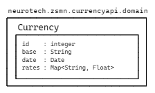
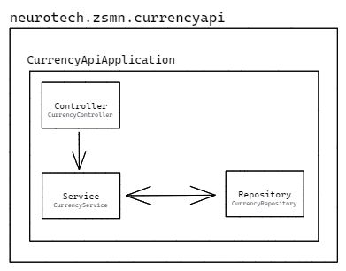
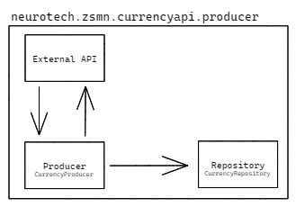
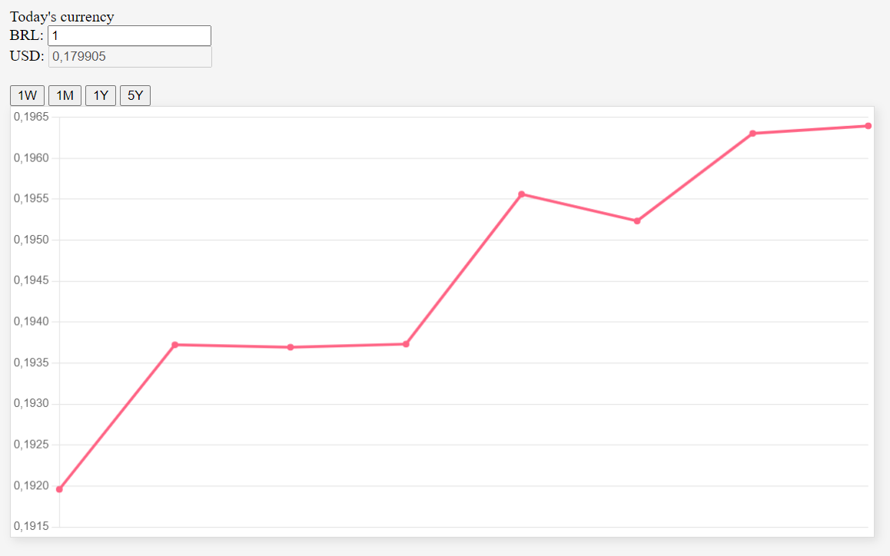

# Neurotech Technical Challenge

This repository contains my approach for the proposed technical challenge provided by Neurotech. The goal was to create an API that provide two endpoints, providing queries to get currency values either the latest and also from a given date interval.

The following topics will describe about the developed architecture (including some details regarding the domain, controller, service, repository, producer and the front-end developed for this application), steps of how to run the application (containing also details about the ports which are allocated) and possible configurations.

## Architecture

The API architecture was developed using the [Spring Boot](https://spring.io/projects/spring-boot) framework, which allowed a faster and clear development of the elements that composes the API.

Also, a Front-End was developed for the visualization of the data. It was developed with [Node.js](https://nodejs.org/en/) and with the libraries [Axios](https://axios-http.com/docs/intro), [Chart.js](https://www.chartjs.org/) and the [http-server](https://www.npmjs.com/package/http-server) package.

### Domain
The domain defines the objects which we will work around at the database and in the project. As the focus was to only work with currencies, this package contains only one object: `Currency`.

<p align="center">
  
</p>

The `Currency` object contains the essential fields for currencies: a given `id` (that is the 'primary key' in the database), a `base`, which is the base currency which the rates will be calculated from, a `date` that stores the date from where the rates were extracted and `rates`, that contains a mapping from other currencies to their values, accordingly to the `base`.


### API
The architecture for the API is shown below:

<p align="center">
  
</p>

The idea is that the `Controller` (extended by the `CurrencyController` class) controls the `endpoints` for the application, instantianing the `Service` (extended by the `CurrencyService` class), that is the class that provides a interface for the requests that are made on the database, which is controlled by the `Repository` (extended by the `CurrencyRepository` class).

Currently, there are available the two required endpoints for this API:

- `/currency/latest`
    - This endpoint provides a `Currency` object as output, carrying the latest available value for currency in the database.
    - If happens that the backend does not have any objects stored in the `Repository`, a `HttpStatus.NO_CONTENT` is outputed from the request.
- `currency/interval`
    - This endpoint provides a list of `Currency` objects as output, carrying the values for the given range.
    - The range is set as two params, `startDate` and `endDate`. Both of them are given as Strings and the Controller output a `HttpStatus.BADREQUEST` as response if they don't follow the pattern `yyyy-mm-dd`.
    - If happens that the backend does not have any objects stored in the `Repository`, a empty list is outputed from the request.

### Producer
The producer acts in the beggining and at some intervals during the execution of the application. It's role is to, literally, produce some data collected from external API's that also provides data related to currencies.

For our project, we have used the [ExchangeRate API](https://exchangerate.host/), that is a free api that provides for free requests from a very long date range. The architecture of the `Producer` is showed below:

<p align="center">
  
</p>

There is a file called `CurrencyProducerConfiguration` with come with several configuration variables:

- `checkPeriod`: Given in days. With this, the producer make a request to obtain the most recent data from the external api, so in this way we can maintain the whole database always up-to-date.
- `initializeDatabase`: Boolean. With this, we can mark if we want to start the database at the initialization or not. **Note:** if this is not marked, the application will restart with a empty database! (except if you remove the `spring.jpa.hibernate.ddl-auto=create` command from the `application.properties` file.)
- `initializePeriodFromToday`: Given in years. This is the parameter which indicates the amount of years **from today** that will fill our database at the application startup.

### Database

For this project we have also created a MySQL database using a Docker container. This allowed us to use the `Spring Datasource` configuration at `application.yml` configuration file, which provided a database interface for the described `Repository`. 

The database create the schema based on the `domain` at **every context refresh**, so it means that when you close and open the application, the database content is **deleted** also. But don't worry about that: the `Producer` will always reproduce the data.

Currently, it is using the latest `mysql` image available and running at the port `3306`. You can check the `docker-compose.yml` file to see more details about it.

### CI/CD

Currently, this project has a cycle of `CI/CD`. In the project, we have a directory called `test` that contains several packages. 

The `controller`, `repository` and `service` packages contains the unit tests for each one of these implementations in our main project, using `Mockito` to mock some of the methods. Also, the `integration` package contains a integration test which allocates a instance of `CurrencyController` and uses it to simulate the entire workflow, reloading the context after every test.

At the github, we have also developed two workflows: for the `main` branch and one for the another branches. The workflow for the `main` branch contains exactly the same pipeline that is executed for the another branches: it setups the repository, compile the project with Maven (also running the CI tests) and ends if everything went ok. The difference is that at the `main` branch it also make a [deployment](https://hub.docker.com/r/zsmn/neurotech-test-api) of a Docker image to [DockerHub](https://hub.docker.com/). This division of workflows was made to fit the concept of deployment only when something reaches the main branch.

### Front-End

It was made for this application a simple front-end that is located at `front` folder. It contains a input text box that allows to convert from the `BRL` to `USD` currency and also provides a chart with 4 buttons. Each button provides a different timeline which is possible to see the values from a range of dates, where `1W` refers to last week until today, `1M` refers to the last month until today, `1Y` refers to the last year until today and `5Y` refers to the last five years until today. **Note that the refence is always `today`, so considering that today is `2022-08-11`, the last week refers to the range `2022-08-04` until `2022-08-11`.**

<p align="center">
  
</p>

## How to run

### Pre-builded Docker (docker-compose)

As we have a deployment to the Docker.io, you can use the `docker-compose` directly to run the entire pipeline for the API:

```bash
docker-compose up
```

In the end, the `MySQL` server and the `CurrencyAPIApplication` will be started and the API will be served at `localhost:8080`.

### Running the front-end

For the front-end we also have a `docker-compose` file, so you can go to the `front` folder and run it with the following command:

```bash
docker-compose up
```

After this, the front-end will start and will be served at `localhost:8081`.

### Running only a single service at docker-compose

You can also run a single service at the `docker-compose` (I have used this a lot to start only the database and make some tests in the project) by calling the following command:

```bash
docker-compose up service_name
```

Where `service_name` refers to the service that you want to start.

### Compiling project with Maven

Also, the project can be compiled with Maven or any IDE that supports it. In my case, I have used the `IntelliJ IDE`. The command to compile the project is given as follows:

```bash
mvn -B package --file pom.xml
```

This command will use the `pom.xml` file to extract the packages and build the project. It will be located at the `target` folder as a `*.jar` file which can be executed to start the API. **Note: Remember that the application needs the MySQL service running to start, so refers to the steps to run a single service at the `docker-compose` file if needed.**